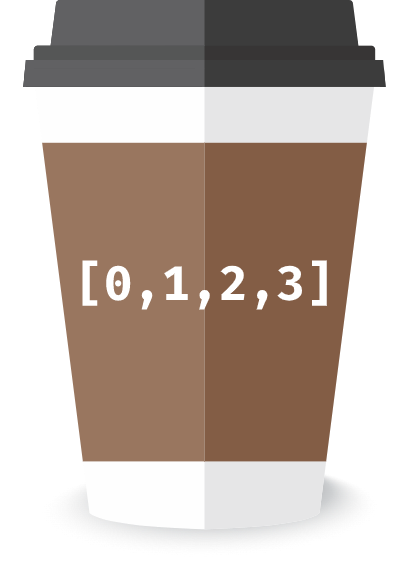

<div id="top"></div>

<!-- PROJECT LOGO -->
<br />
<div align="center">
  <a href="https://github.com/knobs-dev/arrays-to-go">
    
  </a>

  <h3 align="center">Arrays To Go</h3>

  <p align="center">
    Community created, ready to go arrays on the Ethereum network
  </p>
</div>


<!-- TABLE OF CONTENTS -->
<details>
  <summary>Table of Contents</summary>
  <ol>
    <li>
      <a href="#about-the-project">About The Project</a>
      <ul>
        <li><a href="#built-with">Built With</a></li>
        <li><a href="#releases">Releases</a></li>
      </ul>
    </li>
    <li>
      <a href="#getting-started">Getting Started</a>
      <ul>
        <li><a href="#prerequisites">Prerequisites</a></li>
        <li><a href="#installation">Installation</a></li>
      </ul>
    </li>
    <li><a href="#usage">Usage</a></li>
    <li><a href="#roadmap">Roadmap</a></li>
    <li><a href="#contributing">Contributing</a></li>
    <li><a href="#license">License</a></li>
    <li><a href="#contact">Contact</a></li>
    <li><a href="#acknowledgments">Acknowledgments</a></li>
  </ol>
</details>


<!-- ABOUT THE PROJECT -->
## About The Project 🎙️

Filling very long array of numbers on the ethereum network may be too expensive, moreover if you have to do it multiple times. That's why we thought: *"It's literally a waste of computation. Why don't we fill them once and copy the content every time we need it?"*

We know, it may looks like there is no real application for that kind of smart contract, but in fact we have built it for a specific purpose 😅.

There is an easy but clever way to mint NFTs with not sequential ids, but guess what? it requires to have an array with all the possible values. So, here is where this contract come in place 🚀

```solidity
contract MyAwesome10kNFTs {
    uint256[] tokenIds;
    constructor() {
        tokenIds = IArraysToGo(0xfd3e...).safeGetArrayByName("OneToTenK");
    }
}
```

Can't you see the advantages? Filled with just one line of code 💪

<p align="right">(<a href="#top">back to top</a>)</p>


### Built With 

Hardhat + Solidity + Typescript + Solidity Coverage

<p align="right">(<a href="#top">back to top</a>)</p>

### Releases

Network       |Address                                   |
--------------|------------------------------------------|
Polygon Mumbai|0x0897feffd8c14ace22c88a6Af64AaDB746b2cE8e|

<p align="right">(<a href="#top">back to top</a>)</p>


<!-- GETTING STARTED -->
## Getting Started

### Prerequisites

Install the npm package or copy our contract interface
* npm
  ```sh
  npm install @knobs/arraystogo@latest
  ```

### Installation

Import our interface

```solidity
import "@knobs/arraystogo/IArraysToGo.sol";
```

<p align="right">(<a href="#top">back to top</a>)</p>


<!-- USAGE EXAMPLES -->
## Usage 🍽️

Clone an existing array

```solidity
    uint256[] oneToTenKArray = IArraysToGo(0xfd3e...).safeGetArrayByName("OneToTenK");
```

<p align="right">(<a href="#top">back to top</a>)</p>


<!-- ROADMAP -->
## Roadmap 🛣️

- [ ] Release on Ropsten testnet
- [x] Release on Polygon mumbai testnet
- [ ] Release on Ethereum mainnet
- [ ] Release on Polygon mainnet
- [ ] Fill the OneToTenK array

See the [open issues](https://github.com/knobs-dev/arrays-to-go/issues) for a full list of proposed features (and known issues).

<p align="right">(<a href="#top">back to top</a>)</p>


<!-- CONTRIBUTING -->
## Contributing 🧑‍🔧

Contributions are what make the open source community such an amazing place to learn, inspire, and create. Any contributions you make are **greatly appreciated**.

If you have a suggestion that would make this better, please fork the repo and create a pull request. You can also simply open an issue with the tag "enhancement".
Don't forget to give the project a star! Thanks again!

1. Fork the Project
2. Create your Feature Branch (`git checkout -b feature/AmazingFeature`)
3. Commit your Changes (`git commit -m 'Add some AmazingFeature'`)
4. Push to the Branch (`git push origin feature/AmazingFeature`)
5. Open a Pull Request

<p align="right">(<a href="#top">back to top</a>)</p>

## Scripts ⚙️

### Fill Array progressively

```bash
npx hardhat atg/fill_progressively --contract 0x0897feffd8c14ace22c88a6Af64AaDB746b2cE8e --identifier OneToTen --from 1 --to 10 --chunklength 6 --network mumbai
```

<p align="right">(<a href="#top">back to top</a>)</p>


<!-- LICENSE -->
## License ©️

Distributed under the MIT License. See the `LICENSE` file for more information.

<p align="right">(<a href="#top">back to top</a>)</p>


<!-- CONTACT -->
## Contact 📬

Your Name - [@KnobsBlockchain](https://twitter.com/KnobsBlockchain) - info@knobs.it

Project Link: [https://github.com/knobs-dev/arrays-to-go](https://github.com/knobs-dev/arrays-to-go)

<p align="right">(<a href="#top">back to top</a>)</p>


<!-- ACKNOWLEDGMENTS -->
## Acknowledgments

* [Coffee Cup Vectors by Vecteezy](https://www.vecteezy.com/free-vector/coffee-cup)

<p align="right">(<a href="#top">back to top</a>)</p>